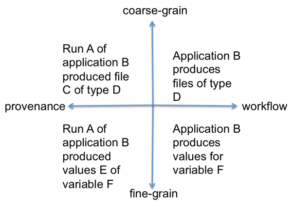
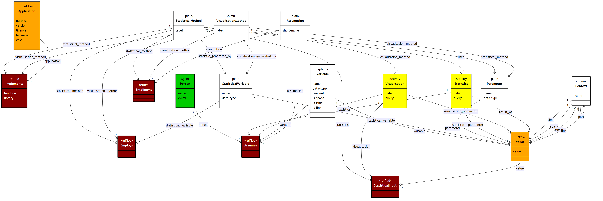
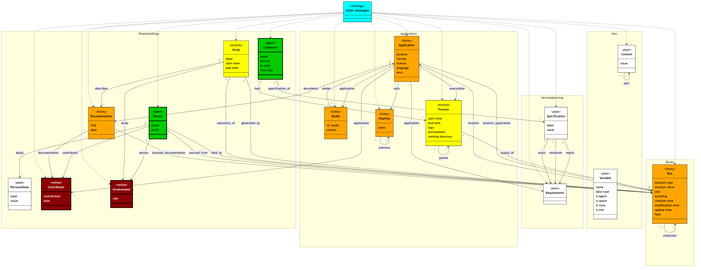
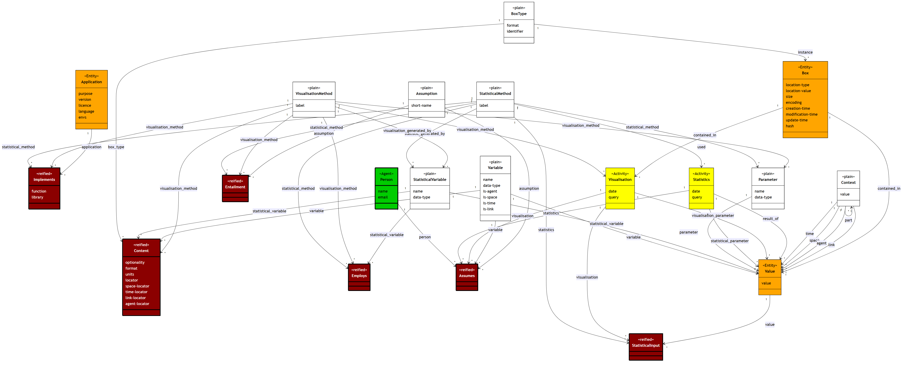
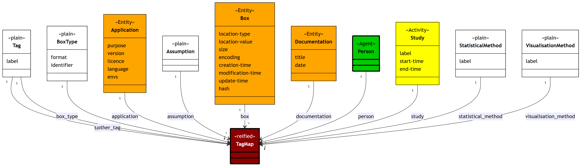
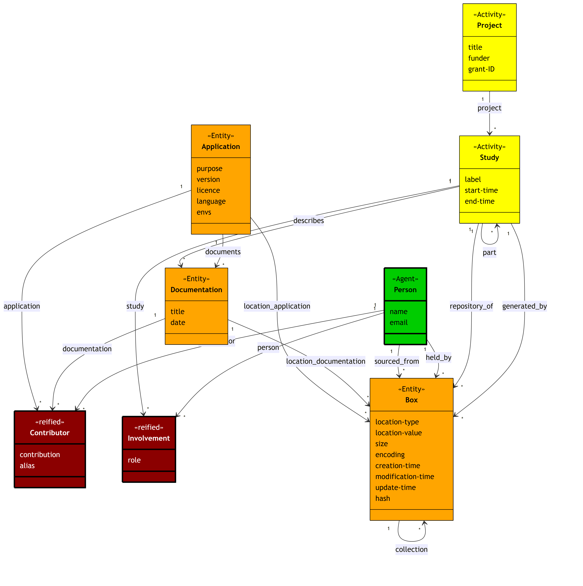
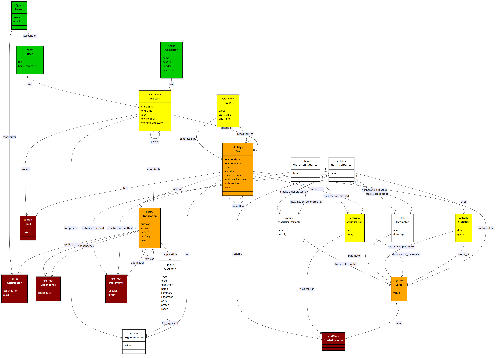
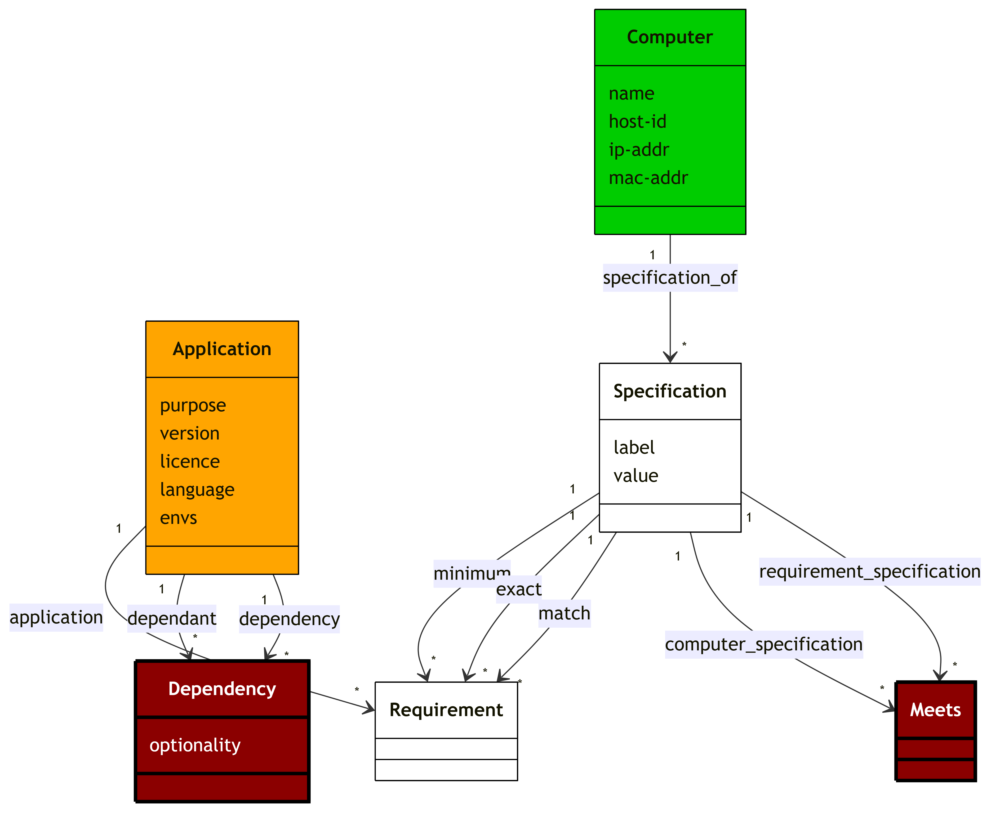
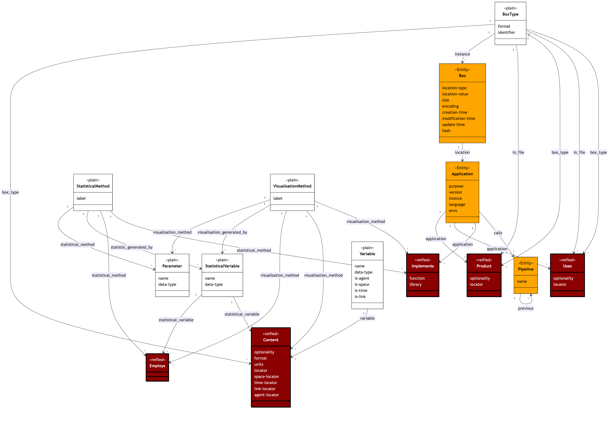

# ChangeLog

| Version | Date | Person | Description |
|---|---|---|---|
| 1.1.3 | 28 April 2015 | Lorenzo Milazzo and Gary Polhill | Original version |
| 1.1.4 | 18 June 2015 | Gary Polhill, Lorenzo Milazzo, Dawn Parker, Calvin Pritchard, Xiongbing Jin | Enhancements for workflow specifications and links with a metadata schema from earlier work at the University of Waterloo |
| 1.1.5 | 7 July 2015 | Gary Polhill and Lorenzo Milazzo | Improvements to fine grain, assumptions and statistics; explicit links to possible external ontologies; record of visualisations |
| 1.1.6 | 26 Nov 2015 | Ju-Sung Lee and Gary Polhill | Improvements to the fine grain; cosmetic improvements |
| 1.1.7 | 29 Apr 2016 | Doug Salt | Corrections. Add Description field to everything. Add About field to everything. Remove Purpose from Pipeline as redundant. Remove Purpose from Application as redundant. Change statisticalInput, statisticalVariable and statisticalMethod |
| 2.0.0 | 8 Nov 2022 | Doug Salt | Tidied up the relations |
| 3.0.0 | 9 Sep 2026 | Doug Salt | Converted to markdown and updated for RESAS release |

# Introduction

The replication 'crisis' [@finelli2018replication] in science generally (and
especially the social sciences [@shrout2018replication]) has
its correlate in social simulation [@edmonds2003]. In our own work [@polhill2017lessons],
the complicated computational workflows associated with preparing, running and
analysing the results of agent-based models have demonstrated the need for
automated record-keeping.

Earlier work identified the various ways
in which provenance metadata could be used to help analyse agent-based models
[@pignotti2013bigprov]. Three types of provenance were identified in that work:

  1. The social processes outlining the history of model development.
  2. Execution of the model and associated code for analysing its results.
  3. Detailed state-change metadata per run.

This document provides a framework in which the first two of these types of
provenance can be recorded.

# Overview

This specification builds on earlier work towards metadata standards for
sharing simulation outputs [@polhill2014towards]. The schema diagram is shown
in Figure 2. 

Note originally this schema was designed to run on a relational database, but
later work has adapted it to run on graph database as well, due to ease of querying
on a graph database [@davoudian2020big]. As such there are many reified relationships in the
relational description of the database. Please note that in the graph database,
the reified relationships have been converted to direct links between entities; the many to many
relation being more natural in a graph database setting. A note has been made
when a reified relationship in the relational schema has been replaced with a
direct link in the graph database.

There are two important dimensions of distinction. First is fine- versus
coarse- grained metadata. Second is provenance versus workflow. Coarse-grained
metadata describes how particular files come (or came) into being, or were (or
could be) used to bring other files into being. Fine-grained metadata describes
specific values recorded in social simulation outputs. To make the distinction
concrete, suppose a simulation produces a CSV file. The data within the CSV
file are covered by fine-grained metadata, whilst the fact that the simulation
produces the CSV file is coarse-grained. Turning to the other dimension,
provenance metadata describes what actually happens (run W of simulation X
produced output file Y), whilst workflow metadata describes what could happen
(simulation X produces an output file of type Z). The distinctions are
summarised in Figure 1.

![Metadata schema for MIRACLE. Boxes indicate tables, arcs represent relations, with 'forked' arrowheads showing the 'many' part of a many-to-one or many-to-many relationship. Tables are coloured in brown if they are breaking a many-to-many relationship (a reified relationship), with yellow, orange and green being used to denote specialisations from the PROV standard Activity, Entity and Agent classes respectively. Thick borders denote tables that are potentially autopopulated. Other tables are assumed to be entirely populated by users. Blue octagons show external databases/ontologies to which this one could be linked.](img/diagram-01.png)

With the schema now having a large number of tables, it is better to
consider it in parts. The following subgraphs of the schema (which
may partially intersect) cover different topic areas of the whole:

  + **Analysis**: Part of the fine grain pertaining only to
    analysis and visualisation.

  + **External**: Links to external ontologies.

  + **Fine-grain**: All fine-grain metadata.

  + **Folksonomy**: Tables allowing tagging.

  + **Project**: Metadata about projects.

  + **Prov**: Tables capturing provenance metadata.

  + **Services**: Tables pertaining to service-provision and matching
    requirements against specifications.

  + **Workflow**: Tables relating to workflow.

The overview section now continues with an explanation of each subgraph
in turn, with consideration given to the degree of user interaction and
maintenance. The remainder of the document explains each
table in detail.

## Analysis

The subgraph for recording metadata about Analysis is shown in Figure 3.
Variables are metadata about the content of files, and may have several
Values. These Values may be visualised, and Statistics may be computed
using them. Statistics are computed using `StatisticalMethods`, and
Visualisations constructed using `VisualisationMethods`.
`StatisticalMethods` produce StatisticalVariables as outputs, which are
stored in the Values table as results-of Statistics. Statistics and
Visualisations are thus conceived as Activities in the PROV vocabulary
[@gao2020big].

When a user of the system has identified some statistics or
visualisations they want to be able to reuse in other studies or record
provenance about, as part of recording the activity, if the statistics
are not something already added by another user, they would make an
entry in the `StatisticalMethods`: or `VisualisationMethods` tables. If
known, the user would also record any Assumptions Entailed by the
methods. This information is not a requirement, as the user may not have
relevant expertise to assert that a particular computation involves an
Assumption; however, this information can be added at any time by any
user. The Employs table can also be filled with data recording when one
Statistical- or Visualisation-Method uses a StatisticalVariable as
input.

Assumptions could be quite trivial -- in the most simple case, for
example, that a numeric Variable is assumed to be a cardinal (as opposed
to ordinal or nominal) when computing the mean of its Values. For other
statistics, Assumptions can record such things as whether the Variable
is normally distributed, or has constant variance.

Once an Assumption has been stated as Entailed by a Statistical- or
Visualisation-Method, it can be automatically inferred that Persons have
made Assumptions about Variables, where they have done Statistics or
Visualisations that use the Methods and Values of those Variables that
are returned by the queries used to get the raw data on which the
activities operated. The query is stored, along with the date made, in
order to avoid populating large relational tables recording the
Visualisations and Statistics that used Values as input data. Note that
Values may also be used to store Parameters and StatisticalVariables
that act to configure Visualisations and Statistics. These are captured
using the visualisation-parameter and statistical-parameter relations,
and the StatisticalInput table.

Visualisations are automatically inferred when the `Box` they are
contained-in has a `BoxType` with a VisualisationMethod in it. The
Values visualised (recorded in the VisualisationValue table) can be
(possibly somewhat dubiously) inferred from the Input to the Application
that ran the Process that created the `Box`, until such time as
statistical tools support logging this information in sufficient detail.

## External ontologies

Though not explicitly noted in the tables, with the exception of OpenABM
(with which this schema had to integrate for the MIRACLE project),
various external ontologies and schemas are relevant, and could be
linked to if required. There are various ways such links could be
manifested (relational tables for example, implementing each of the blue
dashed lines in Figure 4), and those suggested are by no means
exhaustive. Neither is it necessarily the case that any specific
ontology or external schema is proposed or adopted. The following gives
examples of specific external links:

  + Bib -- connection to a bibliographic database (e.g. bibsonomy). Note
    that the Documentation table is intended to be quite generic, and
    include journal and conference articles as well as reports and code
    documentation.

  + Geo -- links to ontologies or databases containing geographical or
    spatial concepts, such as GeoSparql and WGS84. The idea here is that
    we may want to link various table entries to external geographical
    databases, for example, to say that a Study pertained to a
    particular region, or that a `Box` is a GIS file.

  + OpenABM -- links to the [CoMSES-Net archive](https://www.comses.net/codebases/) of
    agent-based models, and is essential in order to identify which
    model these metadata are describing the output analysis of.
    (Although in principle, the system described could be applied to any
    stage of modelling, including setting up the model files, running
    the model and analysing the output, the focus of the MIRACLE project
    is specifically on the output analysis.)

  + Services -- links to vocabularies describing the requirements of
    applications and capabilities of service-providers. Where WSDL and OWL-S
    were once the natural reference points here, most service description in
    practice has since moved to REST-style APIs described using OpenAPI
    (formerly Swagger), which is now the de facto standard for machine-readable
    service interfaces. OpenAPI lacks OWL-S's semantic-reasoning ambitions, but
    its wide tooling support and adoption make it a more practical link for
    automatic discovery of applications and services, including their input and
    output specifications.
 
  + SocialWeb -- we may want to allow people to link to social web tools
    such as ResearchGate, LinkedIn, Facebook and Twitter. The FOAF
    ontology also has attributes that we can draw on, and includes
    vocabulary for modelling social web links.

  + Workflow -- workflow-related ontologies. Standards in this space remain
    relatively immature. The Common Workflow Language (CWL) has emerged as the
    most widely adopted tool-agnostic specification for describing
    computational workflows, and is a natural candidate for linking here. Other
    approaches to modelling workflows, such as Petri-Nets and various business
    process modelling ontologies, remain potentially relevant, though PROV-O
    may be a more durable choice than domain-specific alternatives for
    capturing workflow provenance in particular [@herschel2017survey].

In terms of maintenance, provision for making the links to external
databases would require users to supply the relevant information, except
where specifically supported databases provided an API allowing us to
query them for possibly relevant data to link to.

## Fine grain

The fine grain metadata is information about the contents of files,
including visualisations, and values of variables (Figure 5). Much of
this has been covered already in the Analysis section above, but here we
show how Boxes are disaggregated from a provenance perspective
through saying that Values and Visualisations are contained-in them, and
from a workflow perspective through saying that `BoxType`s have
Variables and `VisualisationMethods` as their content. The provenance side
can be populated automatically, but the workflow metadata would need to
be provided by the user when describing an Application they were making
available to the system: specifically, the user will need to describe
the inputs and outputs of each application, and for each associated
`BoxType`, provide details of Variables and `VisualisationMethods`
given as content. For some file formats, autodetection may assist with
populating the Variable table -- e.g. given an example of a CSV file
used by or generated by an application, a header row could be used to
suggest names for Variables they supply.

## Folksonomy

Folksonomies are informal ontologies developed by a user communities,
with tagging being a pretty much standard way in which this is achieved.
It is not proposed to enrich that here. In Figure 6, the tables thought
most likely to be of interest for users to tag are depicted, though this
needn't be exhaustive. Each of the arcs from the Tag table would
need a relational table to break the jmany-many relationship between
tags and the concepts they are applied to.

## Project

Project metadata is largely for users to enter, and previously may have been
regarded as unduly onerous [@edwards2014lessons]. However, it tells an important
part of the story of a model from a Type 1 provenance [@pignotti2013bigprov]
perspective, and with the advent of large language models, much of
this metadata might be automatically generated. It is provided to facilitate
users in understanding how simulation output data relates to publications
(which would appear in the Documentation table), and specific pieces of work
(Study table). The Study might be the most important table for users to
complete, as this, by its association with `Box`es allows collection of
simulation outputs in useful groups.

## Provenance

Provenance is very much at the heart of the system, with an important
role in recording how results from a model presented in journal articles
are produced [@oliveira2018provenance]. Most of the tables here are autopopulated, as particularly
for large scale analyses, user entry is an unrealistic goal. The system
therefore needs to act as a wrapper around the scripts and tools
(Applications) used to process the raw output from the simulation (which
is the starting point of the MIRACLE project [@jin2017miracle]) into the result used as
part of an article. At the coarse grain, the central activity is the
Process, which is a record of all relevant information of a process that
ran on a Computer. This includes anything needed to replicate that
Process under the same circumstances: the input files it used,
command-line arguments, environment variables (essentially, anything
that might affect its behaviour), and the output files it generated, the
importance of which is illustrated by the challenges encountered when
replicating the analysis of outputs from a social simulation of
biodiversity incentivisation [@polhill2017lessons].

The need for cross-platform support means that it is difficult to draw
on standards for these. Different operating systems, and even different
commands within the same operating systems, use different conventions
for processing input on the command line, and input and output
redirection. The Argument table attempts to record all relevant details
about command-line arguments, allowing ArgumentValues to be inferred
from a specific command-line instruction activating a Process. This is
important in avoiding the need for users to supply too much information
each time they run an Application.

Batch-file processing is assumed at the coarse grain; where processes
involve user interaction that might affect the behaviour, automatic
capture of provenance data would be extremely challenging. Whilst GUIs
might be used during exploratory analysis of simulation output data,
ultimately for reproducibility of results and keeping records of
activities done [@pritchard2025formal], these must ultimately be manifested as scripts that can
be run in batch mode, once a decision is taken that a particular
analysis step needs to be recorded as an application. Applications that
only support GUI interaction can therefore not be supported (and
arguably should be derided as virtually useless for any scientific
endeavour -- assuming repeatability is a desirable attribute of that
work).

At the fine-grain, Statistics and Visualisations are the central
activities. Again, although GUI interaction cannot be supported,
command-line interaction potentially could. Parameters and
StatisticalInput would need to be recorded, and the raw data on which
the activities operate captured somehow in a query allowing the same set
of data to be operated on. Recording the date at which the query was
made is therefore important, especially if Values of Variables are
subsequently populated that might affect the ability of future analyses
to reuse the same data. A short-cut might be to store the date a Value
was generated in the Values table, but since this table is expected to
be 'virtual' (in that a supporting system would gather relevant data
from the raw data files), the date can be captured from the dates of the
Processes generating the `Box`es in which the Values appear, or the
date at which the Statistics were computed if the Value is a
StatisticalInput.

## Services

The services part of the graph depicted in Figure 9 provides a simple
model intended to be used to determine whether an Application can be run
on a Computer. This involves checking the Requirement Specifications of
the Application (and recursively of any Dependencies) against the
Specifications of a Computer. Requirements can be specified in one of
three ways -- for numeric Requirement Specifications, a 'minimum'
Requirement must be exceeded by the Specification of the Computer (e.g.
for RAM). For all types of Requirement Specifications, an 'exact'
Specification must be equal (an example might be the OS -- if the
Application has very specific demands), whilst a 'match' Specification
is a regular expression that the Specification of the Computer must
match. The results are stored in the Meets reified relationship.

A more sophisticated implementation would wrap each Application in a web
service. This would also be more secure if responsibility for providing
Applications as web services was in the hands of their developers -- users of the framework
would then not be uploading Applications to their own system, but instead
sending data for processing by other servers, and capturing metadata
about these interactions. The services architecture could then draw much
more heavily on standard web services ontologies, such as OWL-S and
WSDL.

## Workflow

The standard workflow model provides prescriptive 'recipes' for
undertaking specific procedures [@atkinson2017scientific]. Though we are interested in that here,
and have provided a rudimentary sequence-based `Pipeline` table to handle
that, we are also interested in providing support for exploring what
'could be done' given a current set of circumstances, and 'what needs to
be done' before running an `Application`. For example, suppose we are
interested in getting a `Value` for a particular `Variable`. Then we can see
which `BoxType`s have that `Variable` in their `Content`, and which
Applications have the `BoxType` as a `Product`. If the `BoxType`s
those Applications Use have no instances, then we can find Applications
that have the Uses `BoxType`s as their `Product`, and so on. We can
also search for `Pipeline`s that have the required `Product` by exploring
the `Product`s of the last element of each `Pipeline`'s list-based
structure, and checking the Uses of the first element.

This way, it should be possible, given a set of raw simulation outputs,
to search for sequences of `Application`s to apply that generate a
particular desired `Visualisation`(`Method`). Using the provenance
infrastructure, it would also be possible to explore how other users
have chosen to do it in the past.

# Detailed specifications

All tables have uniquely specified ID fields as primary keys, unless
they are associative tables (or direct links in the case of a graph database). All tables with have a name field. This is
free form text and not always present. It identifies a relation,
however it is not guaranteed to be unique. It is there
to help primarily in readability when trying to extract information from
this database and may contain a human readable label for the relation.
For instance, for the definition of an argument, this would be the
argument name. All tables will have a description field
(dc:description). This field has been included to allow the introduction
of free form documentary text. It is strongly advised that should the
opportunity arise, then such text is supplied.
The authors recommend this practice as it
forms a useful means of documenting job control code in its own right,
used to run these large scale models. Each table also has a
creator/modifier field, and a corresponding created and modified date
time field. Although most databases record this kind of metadata, we
have made it explicit and expect these fields to be populated
automatically. This a deliberate attempt to make this interface database
software agnostic. Note that date fields should be stored as strings
conforming to the ISO 8601 date format, not in the native format of the
database. This is recommended best practice according to the Dublin Core
Metadata Initiative.[^1] The remaining attribute that is always included
in each relation is the \"about\" column. This we have pinched directly
from RDF and uniquely identifies a triple in RDF [@hartig2010publishing]. Although
currently optional, we intend this to uniquely identify the relationship
within our database. The form of this is normally some kind of IRI. This
will allow inward referencing of the provenance and metadata resource
from other standardised resource software that recognizes IRIs.

### Attributes

| Attribute | Description | Standards | Validation | Automation |
|---|---|---|---|---|
| name | A documentary name for the relation or entity | None | None. May or may not be present | None |
| description | Short text to use to summarise what the argument is | None | String | None |
| about | A unique resource identifier. This field will allow inward linking from any external resource that allow IRIs | RFC 3987 and RFC 4622 | IRI | None |
| creator | Who created this particular set of attributes making up this relation | dc:creator | String | Should be done by the agency that has implemented the SSREPI interface. This will be the computer user |
| created | When this document was created | dc:created, ISO8601 | logical date and time validation | Should be done by the agency that has implemented the SSREPI interface. This will be the computer user |
| modifier | Who created this particular set of attributes making up this relation | dc:creator | String | Should be done by the agency that has implemented the SSREPI interface. This will be the computer user |
| modified | When this document was created | dc:modified, ISO8601 | Logical date and time validation. Must come after the date of creation. | Should be done by the agency that has implemented the SSREPI interface. This will be the computer user |

## Annotation

This is not shown in the above diagrams. This is database entry that can
annotate any relation in this database. This can be used to flag certain
properties, or record information about a given set of rows. Such
properties will be recorded in a JSON format for the purposes
validation.

## Standards

JSON for the annotation values. SQL for row restriction.

## Automation

There is an entry which documents a database query (if suitable) that
will document the rows affected. It is up to the standard implementor
whether such queries will be allowed to be performed automatically. We
are recommending only statements that refer to the `Box` table
should be allowed to stop the possibility of SQL injections.

### Attributes

| Attribute | Description | Standards | Validation | Automation |
|---|---|---|---|---|
| id_annotation | Unique key | None | Must be unique | Automated by the instantiating framework |
| json | json describing the values of the records being annotated. | None | Must be unique | Automated by the instantiating framework |
| sql | The SQL describing the range of records affected. This could be a single rows from single or multiple tables. BEWARE OF SQL CODE INJECTION when considering using this field | None | Must be unique | Automated by the instantiating framework |

### Relationships

None.

# References

